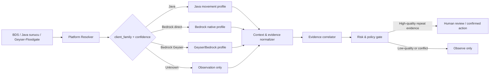

# BedrockGuard Geyser + Bedrock Uyumluluk Teknik Değerlendirmesi

**Durum:** Tasarım raporu; bu belgeyle çalışma zamanı davranışı, puan eşikleri veya yaptırım akışları değiştirilmemiştir.  
**Amaç:** GeyserMC üzerinden Java sunucusuna bağlanan Bedrock Edition oyuncularında yanlış pozitif üretmeden güvenlik analizi yapabilmek için mevcut MVP’nin uygulanabilirliğini değerlendirmek.

## Yönetici Özeti

Geri bildirim teknik açıdan yerindedir. Geyser, Bedrock ve Java’nın farklı protokolleri ile kod tabanları arasında çeviri yapar; GeyserMC bunun bazı davranış ve offset farklarına yol açabildiğini açıkça belirtir.[1] GeyserMC’nin kendi anti-cheat uyumluluk listesi de bazı anti-cheat çözümlerinin Bedrock oyuncularını doğru kontrol ettiğini, bazılarının Bedrock kontrollerini yok saydığını ve bazılarının yanlış pozitif ürettiğini ayırır; ancak bu listenin topluluk derlemesi olduğunu, garanti veya onay teşkil etmediğini ayrıca vurgular.[2]

> **Ana sonuç:** Mevcut BedrockGuard, mesaj moderasyonu ve genel olay puanlaması için uygulanabilir bir MVP’dir; fakat Geyser + Bedrock oyuncularında güvenilir hareket anti-cheat’i değildir. Mevcut `movement_anomaly` sinyali tek bir genel hız eşiğine dayandığından, platform kökeni ve hareket bağlamı olmadan Speed, Fly veya packet-spoofing kararı vermek üretim için güvenli değildir.

Bu nedenle Bedrock-aware tespit, tek bir “Bedrock’a daha yüksek eşik” kuralı değil; **oyuncu kökenini doğrulayan veri sözleşmesi, platforma özgü hareket profilleri, bağlam filtresi, kanıt korelasyonu, gölge mod ve insan onayı** içeren ayrı bir karar katmanı olmalıdır.

## 1. Mevcut BedrockGuard Mimarisi: Güçlü Yanlar ve Yetersizlikler

BedrockGuard bugün imzalı Agent olaylarını alır, metin/komut/blok/eşya/hareket sinyallerini puanlar, puanı zamanla azaltır ve tekrar ile farklı sinyalleri birlikte değerlendiren bir karar katmanı uygular. Tekil yüksek puanı incelemeye yönlendirme ve AI sinyalinin tek başına yaptırım verememesi, yanlış pozitif azaltma açısından doğru temel korumalardır.

Ancak mevcut uygulamadaki hareket kontrolü `speedBlocksPerSecond > maxMovementSpeed` mantığıyla çalışan tek eşiklidir. Olay şeması oyuncu UUID’si, adı, olay türü ve serbest `metadata` kabul eder; `clientPlatform`, `transport`, `isFloodgatePlayer`, Geyser sürümü, Bedrock protokol sürümü, ping, konum örnekleri, çevre blokları veya ölçüm kaynağı zorunlu alan değildir. Bu nedenle aynı hareket gözlemi Java, doğrudan BDS Bedrock ve Geyser/Floodgate Bedrock için aynı anlama gelir.

| Alan | Mevcut MVP durumu | Geyser + Bedrock üretim eksikliği | Risk |
|---|---|---|---|
| Oyuncu kökeni | UUID/ad ve serbest metadata | Java, doğrudan Bedrock ve Floodgate/Geyser ayrımı zorunlu değil | Yanlış profil seçimi |
| Hareket | Tek genel hız metriği | Zaman serisi, konum, hareket modu, ortam ve ölçüm doğruluğu yok | Speed/Fly yanlış pozitifi |
| Paket anomalisı | Doğrudan paket kanıtı yok | Sıra, tekrar, gecikme, yeniden sıralama ve çeviri izi yok | “Packet spoofing” iddiası kanıtsız kalır |
| Çevre | Genel metadata alanı | Zemin, sıvı, merdiven, piston, araç, efekt, teleport ve blok offset bağlamı şemalı değil | Normal mekanik hile gibi görünür |
| Karar | Puan + tekrar + sinyal çeşitliliği | Sinyalin platforma uygunluğu/ölçüm provenansı puanlanmıyor | Yanlış kanıtın tekrar edilmesi yaptırım doğurabilir |
| Yaptırım | Onay gerektiren kick/review, otomatik ban varsayılan kapalı | Platforma özgü kill switch veya gölge mod yok | Hatalı kuralın geniş etkisi |

GeyserMC’nin belgelediği bambu çevresindeki Java/Bedrock offset kaynaklı hareket sorunu, çevresel bağlam olmadan tek bir sapmanın ne kadar yanıltıcı olabileceğine somut örnektir.[1] Aynı şekilde, 2020 tarihli bir Geyser izleyicisinde Bedrock sprint-jump davranışının anti-cheat tarafından düzensiz hareket/hız olarak işaretlenip kick’e dönüştüğü raporlanmıştır; bu tarihsel vaka güncel oranı ispatlamaz, ancak mekanik farkın gerçek bir yanlış-pozitif sınıfı olduğunu gösterir.[3]

## 2. Oyuncu Kaynağını Ayırt Etmek İçin Toplanacak Veriler

Platform sınıflaması isim ön eki veya kullanıcı beyanıyla yapılmamalıdır. Geyser API, bir UUID için Geyser bağlantısını sorgulamaya; Floodgate API ise `isFloodgatePlayer(UUID)` ile çevrimiçi oyuncunun Bedrock kökenli olup olmadığını belirlemeye imkân verir.[4] Floodgate ayrıca `FloodgatePlayer` üzerinden Bedrock istemci bilgilerine erişim sunar; kullanılan alanlar kurulu sürümün API sözleşmesi doğrulanmadan zorunlu kabul edilmemelidir.[5]

Önerilen en küçük kimlik profili aşağıdadır. Kimlik bağımsız bir “platform resolver” tarafından üretilmeli; BDS Agent yalnızca bu imzalı profili olaylara bağlamalıdır.

| Veri | Değer örneği | Kaynak | Saklama yaklaşımı | Neden gerekli |
|---|---|---|---|---|
| `client_family` | `java`, `bedrock_direct`, `bedrock_geyser`, `unknown` | Geyser/Floodgate veya BDS oturum katmanı | Oyuncu oturumu + olay anı | Kural profili seçimi |
| `identity_provider` | `floodgate`, `xbox_live`, `java_online`, `offline` | Floodgate/BDS | Takma ad, kısa süreli | Kimlik çözümleme doğruluğu |
| `platform_confidence` | `high`, `medium`, `low` | Resolver | Olay anı | Belirsiz kaynakta yaptırımı sınırlar |
| `client_version` | Sürüm etiketi | Geyser/Floodgate, mevcutsa | Normalize edilmiş major/minor | Sürüm kırılmalarını kümeler |
| `proxy_path` | `geyser_velocity`, `geyser_standalone`, `direct_bds` | Dağıtım adaptörü | Sunucu ayarı + olay | Ölçümün nerede yapıldığını açıklar |
| `session_id` | rastgele oturum kimliği | Agent | Kısa ömürlü | Reconnect ve kanıt birleştirme |
| `measurement_source` | `bds_authoritative`, `geyser_translated`, `proxy_observed` | Veri üreticisi | Her metrik | Kanıt güvenini hesaplama |

IP adresi, ham cihaz kimliği, tam paket gövdesi veya kalıcı XUID gibi hassas/veri minimizasyonu açısından riskli alanlar varsayılan olarak toplanmamalıdır. Cihaz sınıfı veya Bedrock sürümü gerçek bir ihtiyacı karşılıyorsa, ham değer yerine izinli kategoriler ve kısa saklama süresi kullanılmalıdır.

## 3. Önerilen Bedrock-aware Detection Mimarisi

Önerilen tasarım, mesaj moderasyonundan bağımsız bir **Movement Evidence Pipeline** ekler. Bu hat önce olayın hangi istemci yolundan geldiğini belirler; sonra olayın ölçüm kaynağını ve çevresini doğrular; yalnızca profile uygun kontrollerden üretilen kanıtları risk kararına iletir.

### 3.1 Platform Resolver

Resolver, oyuncu oturumu başladığında Geyser/Floodgate sinyalini sorgular ve sonucu `client_family`, `platform_confidence`, `proxy_path`, `profile_revision` ile imzalı biçimde Agent’a verir. Resolver yanıtı kaybolursa oyuncu **`unknown`** kalmalı; `unknown` oyuncu Java varsayımıyla anti-cheat yaptırımına alınmamalıdır.

### 3.2 Context & Evidence Normalizer

Normalizer farklı katmanlardan gelen ölçümleri ortak bir kanıt biçimine çevirir. Her kanıt, “ne oldu?” kadar “nerede, nasıl ve hangi kesinlikle ölçüldü?” sorusunu da içermelidir.

| Kanıt alanı | Örnek | Önemi |
|---|---|---|
| `metric` | `horizontal_speed`, `vertical_displacement`, `position_sequence_gap` | Kuralın ölçtüğü değer |
| `observed_value`, `expected_range` | `8.2`, `[0, 7.6]` | Eşik yerine görünür hesap |
| `sample_window_ms`, `sample_count` | `2000`, `14` | Tek örnek ile seri ayrımı |
| `position_trace_digest` | özet/hash | Ham koordinat saklamadan tekrar doğrulama |
| `environment_flags` | `water`, `elytra`, `vehicle`, `slime`, `bamboo_nearby` | Meşru mekanik istisnaları |
| `server_effects` | `speed_amplifier`, `levitation`, `knockback` | Mekanik/efekt bağlamı |
| `network_quality_band` | `stable`, `jittery`, `loss_suspected` | Gecikme kaynaklı sapmayı ayırma |
| `measurement_source` | `authoritative_server` | Kanıt güven ağırlığı |
| `translator_context` | `geyser`, sürüm/özellik etiketi | Çeviri yolunu görünür kılma |

### 3.3 Evidence Correlator ve Policy Gate

Korrelatör, aynı oturumda farklı tipte yüksek kaliteli kanıt arar. Örneğin “Speed” etiketi; bir hız serisi, geçerli çevre bağlamı, beklenen aralığın aşılması, yeterli örnek sayısı ve zaman yakınlığında ikinci bağımsız sinyal olmadan yaptırım gücüne erişmemelidir. Bedrock/Geyser profillerinde ilk aşamada bu sinyaller yalnızca `observe` veya `review` üretmelidir.

## 4. Mesaj Moderasyonu, Davranış Analizi ve Anti-cheat Ayrımı

Bu üç alan aynı oyuncu risk görünümünde birleşebilir; fakat aynı sinyal türü, aynı kanıt standardı veya aynı yaptırım politikasını paylaşmamalıdır.

| Katman | Birincil veri | Doğruluk standardı | Uygun otomasyon | Geyser etkisi |
|---|---|---|---|---|
| Mesaj moderasyonu | Sohbet, komut, tekrar oranı | Metin kuralı / dil bağlamı | Düşük riskli uyarı, kuyruklama | Çok düşük; yalnızca kimlik eşleme önemlidir |
| Davranış analizi | Blok/eşya oranı, oturum paterni | Zaman serisi + oyun ekonomisi bağlamı | İzleme ve inceleme | Orta; istemci akışı ve gecikme yorumlamayı etkileyebilir |
| Hareket anti-cheat | Konum, hız, çarpışma, hareket modu | Platforma özgü fizik + çoklu kanıt | Başlangıçta yalnızca inceleme | Çok yüksek; Geyser çevirisi doğrudan kararı etkiler |
| Paket bütünlüğü | Sıra, tekrar, imza, sunucu doğrulaması | Yetkili gözlemci + protokol bilgisi | İstemci yoluna göre sınırlı | Çok yüksek; Bedrock paketi Java paketi değildir |

Mesajdaki reklam veya tehdit kanıtı, hareket anomalisinin doğruluğunu artırmamalıdır. Ortak oyuncu şüphe toplamı görünebilir; ancak yüksek riskli hareket yaptırımı için gereken minimum kanıt **movement-domain** içinde sağlanmalıdır. Aksi hâlde agresif sohbeti olan masum bir Bedrock oyuncusu, zayıf hareket sinyaliyle haksız yaptırıma yaklaşabilir.

## 5. Speed, Fly ve Packet Spoofing İçin Tolerans Tasarımı

### Speed

Bedrock/Geyser için genel “%N daha yüksek eşik” sabiti güvenilir bir çözüm değildir. Bunun yerine profil; düz zeminde yatay hareket, sprint, sprint-jump, su, merdiven, buz, soul speed, araç, patlama/knockback, iksirler ve sunucu özel eklenti etkileri için ayrı beklenen aralıklar kullanmalıdır. Eşik aşımı tek başına kanıt değil, **aday anomali**dir.

Önerilen karar kuralı:

1. Çevre veya sunucu efekti meşru açıklama veriyorsa sinyal bastırılır ve yalnızca telemetri kaydedilir.
2. Ağ kalitesi belirsizse sinyalin güveni düşürülür; ardışık stabil pencereler beklenir.
3. Geyser/Berock profilinde yalnızca yetkili sunucu ölçümü, yeterli örnek ve bağımsız tekrar ile `review` oluşturulabilir.
4. Kick/ban için ayrı oturumlarda veya aynı oturumda birden fazla yüksek güvenli, açıklanamayan kanıt gerekir; insan onayı varsayılan olmalıdır.

### Fly

Fly kontrolü, dikey yer değiştirmeyi tek başına kullanmamalıdır. Uçuş izni, yaratıcı/seyirci modu, elytra, levitation, su sütunu, balçık bloğu, piston, araç, teleport, geri itme, özel eklenti mekaniği ve dünyaya özgü hareket modları kanıta dahil edilmelidir. Geyser profilinde konum düzeltmesi/çeviri sapması ihtimali varsa “uçuş” etiketi `translation_suspected` alt nedeni ile yalnızca gözleme alınmalıdır.

### Packet Spoofing

BedrockGuard mevcut MVP’sinde paket seviye veriye sahip değildir; bu nedenle bugün “Packet Spoofing” tespit edemez ve etmemelidir. Gelecekte bu etiket yalnızca paketlerin görülebildiği, sıralama ve tekrar mantığının o protokole özgü yorumlandığı katmanda kullanılabilir. Geyser sonrasında Java tarafında görünen paket dizisini Bedrock istemcisinin sahte paketi olarak yorumlamak yanlıştır; çeviri katmanı gözlemi dönüştürür.

Bu sebeple Geyser profilinde başlangıç politikası: **packet-spoofing otomatik yaptırımı kapalı**, yalnızca imzalı Agent telemetrisi veya yetkili Geyser/proxy adaptörünün açık bütünlük ihlali kanıtı varsa inceleme.

## 6. Veri Sorumlulukları: BDS, Geyser/Floodgate ve BedrockGuard Agent

| Katman | Toplaması uygun veriler | Toplamaması / karar vermemesi gerekenler |
|---|---|---|
| BDS / oyun sunucusu | Oyuncu kimliği, oyun modu, izinler, server-authoritative konum/mode değişimleri, blok/etkileşim bağlamı, efektler, teleport/komut nedenleri | Geyser oyuncusunun Java paketiyle “hile” olduğu sonucu; cihaz kimliği ve gereksiz ham telemetri |
| Geyser / Floodgate | `isFloodgatePlayer`, Geyser bağlantısı, desteklenen istemci profili, proxy yolu, isteğe bağlı sürüm/kategori bilgisi | Ham Bedrock paketlerini kalıcı saklama; tek başına Speed/Fly yaptırımı |
| BedrockGuard Agent | Kaynakları birleştirme, zaman damgası, session ID, ölçüm kaynağı, imza, boyut sınırı, güvenli iletim | Platform bilgisini tahmin etme; ham paket yeniden yorumlama |
| BedrockGuard Engine | Profil seçimi, kanıt korelasyonu, puan/karar politikası, insan inceleme paketi | Ölçüm kaynağı belirsiz sinyalden otomatik kick/ban; AI ile fiziksel hile kararı |

Geyser/Floodgate, Bedrock oyuncusunu tanımlamak için doğru yetkili katmandır. Geyser API’de bağlantı UUID ile sorgulanabilir; Floodgate API’de `isFloodgatePlayer(UUID)` ve `getPlayer(UUID)` öne çıkan yüzeylerdir.[4][5] Proxy ile backend ayrılmışsa Floodgate verisinin backend’e taşınması için proxy yapılandırmasının uyumlu olması gerekir.[5]

## 7. Güven Puanı ve Kanıt Sistemi

Mevcut “şüphe puanı” modelinin yerine geçmek gerekmez; fakat hareket anti-cheat için ikinci bir **evidence quality** ekseni eklenmelidir. Toplam risk, kanıt niteliğini saklamamalıdır.

| Boyut | Ölçek | Örnek hesap |
|---|---:|---|
| `anomaly_severity` | 0–100 | Beklenen aralıktan sapma büyüklüğü |
| `evidence_quality` | 0–100 | Yetkili ölçüm, örnek sayısı, bağlam bütünlüğü, ağ istikrarı |
| `platform_fit` | 0–100 | Kuralın seçilen istemci profiline uygunluğu |
| `corroboration` | 0–100 | Bağımsız ve tekrarlanan kanıtların varlığı |
| `action_eligibility` | boolean/katman | Sadece yüksek kalite + yüksek uyum + doğrulanan tekrar sonrası `review` veya üstü |

Önerilen ilke şudur: `severity` yüksek olsa bile `evidence_quality` veya `platform_fit` düşükse sinyal oyuncu toplam puanına sınırlı katkı yapar ve yaptırım uygunluğu kazanmaz. Kanıt çelişkiliyse veya platform `unknown` ise değerlendirme yalnızca telemetri ve yönetici incelemesi olur.

İnceleme paneli için minimum kanıt paketi; zaman çizelgesi, platform profili, ölçüm kaynağı, çevre/efekt bayrakları, örnek sayısı, beklenen/ölçülen aralık, bastırma nedeni ve önceki benzer olayları içermelidir. Yöneticinin “neden bu sinyal bastırıldı?” sorusunu da yanıtlayabilmesi, yanlış pozitif güveni için kritik önemdedir.

## 8. Gerçek Sunucuda Test Planı

Üretimden önce otomatik birim testi yeterli değildir. Testler Java, doğrudan Bedrock ve Geyser/Floodgate Bedrock için ayrı kohortlarda; sürüm, proxy topolojisi ve gecikme koşullarıyla yürütülmelidir.

| Test grubu | Senaryo | Başarı ölçütü |
|---|---|---|
| Platform tanıma | Java, doğrudan Bedrock, Floodgate Bedrock, bilinmeyen kaynak | Yanlış profil seçimi yok; belirsiz profil yaptırım üretmez |
| Speed tabanı | Yürüme, sprint, sprint-jump, buz/su/merdiven/araç/elytra | Bedrock yanlış-pozitif oranı raporlanır; eşik kararı veriye dayanır |
| Fly/vertical | Levitation, slime, piston, knockback, teleport, yaratıcı mod | Meşru dikey hareket otomatik yaptırım doğurmaz |
| Çeviri kenarları | Bambu/offset, dar çarpışma alanları, lag spike, reconnect | Sinyal bastırma ve kanıt etiketi doğru çalışır |
| Paket bütünlüğü | Sadece yetkili proxy/Geyser adaptörü olan laboratuvar | İddia edilen ihlal, açık ölçüm kaynağı olmadan oluşmaz |
| Kötü niyet simülasyonu | Yetkili test hesaplarıyla bilinen hile senaryoları | Tespit oranı ve yanlış negatifler ayrı raporlanır |
| Gölge mod | Gerçek sunucuda yaptırımsız telemetri | Profillere göre yanlış pozitif oranı, gecikme ve yönetici geri bildirimi ölçülür |
| Canlı kademeli açılış | Önce observe, sonra review, en son sınırlı yaptırım | Her aşamada geri alma düğmesi ve platform kill switch bulunur |

Ölçülmesi gereken temel metrikler: platform bazında yanlış pozitif oranı, incelemeye giden olayların onay/red oranı, sinyal başına yönetici iptal oranı, tespit gecikmesi, Agent teslim başarısı ve kural profili sürümüne göre regresyon oranıdır. “Bedrock oyuncusu hiç işaretlenmiyor” başarı değildir; hedef, hile sinyalini yakalarken meşru davranışı cezalandırmamaktır.

## 9. MVP’den Üretim Seviyesine Öncelikli Geçiş

| Öncelik | Aşama | Çıktı | Üretim kapısı |
|---:|---|---|---|
| P0 | Kapsamı dondur | Mevcut MVP’de hareketten otomatik yaptırım yok; Speed/Fly sadece gözlem/inceleme | Bu tasarım onaylanmadan yeni anti-cheat kuralı açılmaz |
| P1 | Platform resolver | Floodgate/Geyser işaretli, imzalı `client_family` profili | Java/Bedrock/unknown ayrımı test edilir |
| P2 | Şemalı telemetri | Ölçüm kaynağı, çevre ve hareket örneği sözleşmesi | Veri minimizasyonu ve şema doğrulaması |
| P3 | Gölge mod | Platform profili başına kanıt/yanlış pozitif ölçümü | Yeterli örnek ve yönetici onay oranı |
| P4 | Bedrock-aware kurallar | Speed/Fly için profil ve bağlam filtresi | Sadece `review`; otomatik kick/ban kapalı |
| P5 | İnsan inceleme UX’i | Kanıt zaman çizelgesi, bastırma nedeni, profil görünümü | İptal/override denetim kaydı |
| P6 | Sınırlı uygulama | Yüksek güvenli, tekrar eden kanıtta kontrol edilen aksiyon | Kill switch, sürümleme, geri alma |
| P7 | Sürekli kalibrasyon | Sürüm/proxy/topoloji bazlı regresyon matrisi | Kural yayın onayı ve güvenlik incelemesi |

## Sonuç

BedrockGuard, Geyser uyumlu bir güvenlik ürünü olabilir; ancak bu, mevcut genel hız eşiğinin üstüne birkaç istisna eklemekle elde edilmez. Ürünün anti-cheat bölümü platform-farkındalıklı, ölçüm kaynağına duyarlı ve kanıt odaklı bir alt sistem olarak gelişmelidir. Mesaj moderasyonu mevcut mimaride daha erken üretim değerine sahiptir; hareket anti-cheat ise önce gözlem, sonra insan incelemesi, en son doğrulanmış profile bağlı sınırlı uygulama yoluyla olgunlaştırılmalıdır.

## References

[1]: https://geysermc.org/wiki/geyser/current-limitations/ "GeyserMC – Current Limitations"
[2]: https://geysermc.org/wiki/geyser/anticheat-compatibility/ "GeyserMC – Anticheat Compatibility"
[3]: https://github.com/GeyserMC/Geyser/issues/460 "GeyserMC/Geyser Issue #460 – Bedrock clients kicked for irregular movements / speed by anti-cheat"
[4]: https://geysermc.org/wiki/geyser/getting-started-with-the-api/ "GeyserMC – Getting Started with the API"
[5]: https://geysermc.org/wiki/floodgate/api/ "GeyserMC – Floodgate API"
